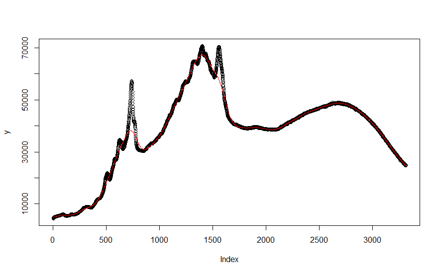
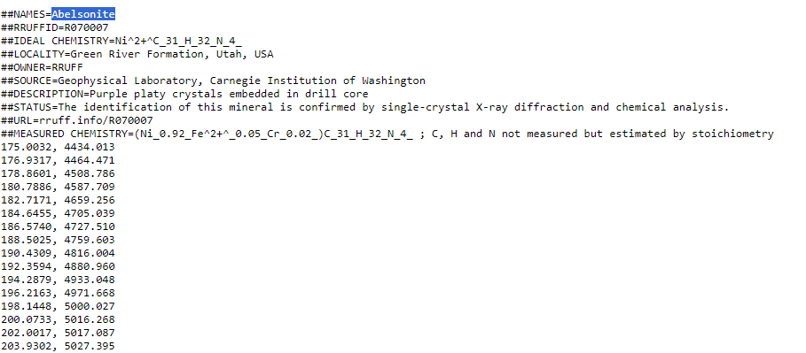

# Introduction
In the domain of (Raman) Spectroscopy it is a common problem and nuisance that the measured signal is a combination of "chemical information", a (background) baseline and random noise (@Zhang2010). The so called baseline signal appears in the measurement as a smooth curve over the measured spectrum and it is important to estimate it and correct for it to allow e.g. for the correct integration of the part of the measured signal that truly belongs to chemical characteristics of the sample of interest.

A sample of a raw Raman spectrum (for the mineral Abelsonite) is shown in the below picture. The data was taken from @Lafuente2016



The package at hand implements a semi-automatic baseline correction using asymmetrically reweighted penalized least squares smoothing as described in @Baek2015.
This algorithm estimates a baseline by trying to solve a multi criteria optimisation problem. It tries to find a line that satisfies (to various degrees the following criteria):

* closely follow the original measurements 
* don't have much curvature ("wigglyness")
* be located below the original measurements

To balance 1. and 2. a user provided smoothness parameter $\lambda$ is taken into account. To satisfy 3., the algorithms uses a list of weights that put the estimation emphasis (error minimisation) of any given iteration on areas where the baseline is over or close to the original signal. While areas with a large difference between baseline and original measurement are assumed to be due to a valid signal peak in that area. The algorithm will assign low weights for the optimisation efforts to those areas as it would be counter productive to try and force the baseline to mirror any actual signal peak, given that the whole point of a baseline estimation is to tell the background noise apart from the valid signal. 

# Usage
In terms of usage of the package, the end user will need to provide an input vector of a measured spectrum, a smoothness parameter $\lambda$ to control the allowed curvieness of the baseline estimate and a stopping criterion in terms of maximum number of iterations and/or percentage changes of the internal weight parameters from one iteration to the next. 

## Input Data
The main function of the package is baseline_estimation() and it requires as input data a vector of positive integers or floats representing the measurements across a range of wavelengths or so called wavenumbers^[Raman spectra are often recorded across socalled wavenumbers with a unit of measurement that is the inverse wavelength expressed in cm, so 1/cm].
A sample of such data is e.g. the raw spectrum measured for Abelsonite^[https://rruff.info/repository/sample_child_record_raman_full/by_minerals/Abelsonite__R070007__Broad_Scan__532__0__unoriented__Raman_Data_RAW__13756.txt] that can be obtained from the RRUFF database (@Lafuente2016).  The first couple of rows of this spectrum are depicted in Figure below.


It is left to the user to only feed the column with the measurements to the baseline estimation function. The algorithm performs reasonably fast on common consumer laptops for a couple of thousand rows, but slows down considerably for much larger spectra (of e.g. 10k rows). Further input data required from the user are the parameter values for lambda (the smoothness parameter), ratio (one of the stopping criteria based on conversion of the results) and maximum number of iterations (a fall back stopping criterion in case the algorithm doesn't convert). For all of these parameters the estimation function will provide default values taken from p. 253 of @Baek2015.

The function has a verbose mode that will render the current estimate of the baseline and print some diagnostic information to the console during the estimation process.
This might be particularly useful for large spectra that can take a long time.
The console output can serve as some kind of progress indication.

As part of the package the spectrum of Abelsonite from @Lafuente2016 is provided and can be loaded as shown below.
```{r}
library(baselineARPLss)
data("Abelsonite")
head(Abelsonite,10)
```

## Function call

With such input data at hand one of the most basic calls of the baseline_estimation function would be as shown below

```{r}
result<-baseline_estimation(Abelsonite$measurement)
```

The package will use an S3 object of the class arPLSresult to store the results of the baseline estimation. The data structure behind this object is a named list with input data, result and parameter values.  
The rational is that similarly to the result object of a lm-regression is would be important or at least useful to have contextual information beside the end result. This additional information includes the parameter values with which the algorithm was run:
\begin{itemize}
    \item raw spectrum that was used as input data
    \item smoothness parameter lambda that the user provided
    \item ratio parameter provided by the user as one stopping criterium
    \item maximum iteration parameter provided by the user as an additional stopping criterium
    \item estimated baseline after the algorithm stopped
    \item last iteration executed when the algorithm stopped
    \item last weight vector ration at the time when the algorithm stopped
\end{itemize}
The last two pieces of information allow to determine if the algorithm stopped because it converged or because it ran out of iteration.
Given that the result is a custom data structure there is a summarize and plot function for this class. The custom plot function will plot the original raw spectrum with the estimated baseline overlaid. The usage is shown below.
```{r}
plot(result)
```
The custom summary function will print the control parameter with which the algorithm was called as well as the reason why it stopped (e.g. conversion vs. maximum iterations). The call of this function is demonstrated below.
```{r}
summary(result)
```

# Bibliography


