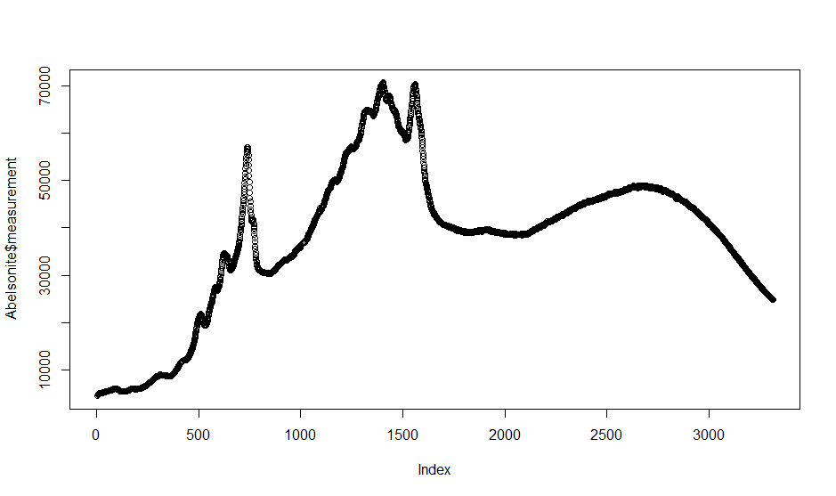

# Preliminaries for OSX users
To use this package you have to have a FORTRAN compiler installed.
Please see https://cran.r-project.org/bin/macosx/tools/ and https://mac.r-project.org/tools/ for more details. 


# Introduction
In the domain of (Raman) Spectroscopy it is a common problem and nuisance that the measured signal is a combination of "chemical information", a (background) baseline and random noise (@Zhang2010). The so called baseline signal appears in the measurement as a smooth curve over the measured spectrum and it is important to estimate it and correct for it to allow e.g. for the correct integration of the part of the measured signal that truly belongs to chemical characteristics of the sample of interest.

A sample of a raw Raman spectrum (for the mineral Abelsonite) is shown in the below picture. The data was taken from @Lafuente2016



The package at hand implements a semi-automatic baseline correction using asymmetrically reweighted penalized least squares smoothing as described in @Baek2015.
This algorithm estimates a baseline by trying to solve a multi criteria optimisation problem. It tries to find a line that satisfies (to various degrees the following criteria):

* closely follow the original measurements 
* don't have much curvature ("wigglyness")

To balance 1. and 2. a user provided smoothness parameter $\lambda$ is taken into account. The algorithms uses a list of weights that put the estimation emphasis (error minimisation) of any given iteration on areas where the baseline is close to the original signal. While areas with a large difference between baseline and original measurement are assumed to be due to a valid signal peak in that area. The algorithm will assign low weights for the optimisation efforts to those areas as it would be counter productive to try and force the baseline to mirror any actual signal peak, given that the whole point of a baseline estimation is to tell the background noise apart from the valid signal. 

# Usage
In terms of usage of the package, the end user will need to provide an input vector of a measured spectrum, a smoothness parameter $\lambda$ to control the allowed curvieness of the baseline estimate and a stopping criterion in terms of maximum number of iterations and/or percentage changes of the internal weight parameters from one iteration to the next. 

## Input Data
The main function of the package is baseline_estimation() and it requires as input data a vector of positive integers or floats representing the measurements across a range of wavelengths or so called wavenumbers^[Raman spectra are often recorded across socalled wavenumbers with a unit of measurement that is the inverse wavelength expressed in cm, so 1/cm].
A sample of such data is e.g. the raw spectrum measured for Abelsonite^[https://rruff.info/repository/sample_child_record_raman_full/by_minerals/Abelsonite__R070007__Broad_Scan__532__0__unoriented__Raman_Data_RAW__13756.txt] that can be obtained from the RRUFF database (@Lafuente2016).  The first couple of rows of this spectrum are depicted in Figure below.


It is left to the user to only feed the column with the measurements to the baseline estimation function. The algorithm performs reasonably fast on common consumer laptops for a couple of thousand rows, but slows down considerably for much larger spectra (of e.g. 10k rows). Further input data required from the user are the parameter values for lambda (the smoothness parameter), ratio (one of the stopping criteria based on conversion of the results) and maximum number of iterations (a fall back stopping criterion in case the algorithm doesn't convert). For all of these parameters the estimation function will provide default values taken from p. 253 of @Baek2015.

The function has a verbose mode that will render the current estimate of the baseline and print some diagnostic information to the console during the estimation process.
This might be particularly useful for large spectra that can take a long time.
The console output can serve as some kind of progress indication.

As part of the package the spectrum of Abelsonite from @Lafuente2016 is provided and can be loaded as shown below.
```{r}
library(baselineARPLss)
data("Abelsonite")
head(Abelsonite,10)
```

## Function call

With such input data at hand one of the most basic calls of the baseline_estimation function would be as shown below

```{r}
result<-baseline_estimation(Abelsonite$measurement,max_iter=20)
#due to default values that is the equivalent for the following function call
#result <- -baseline_estimation(Abelsonite$measurement, lambda = 1e6, 
#ratio = 1e-6, max_iter = 20,verbose=FALSE, algo="banded")
```

The package will use an S3 object of the class arPLSresult to store the results of the baseline estimation. The data structure behind this object is a named list with input data, result and parameter values.  
The rational is that similarly to the result object of a lm-regression it would be important or at least useful to have contextual information beside the end result. This additional information includes the parameter values with which the algorithm was run:
\begin{itemize}
    \item raw spectrum that was used as input data
    \item smoothness parameter lambda that the user provided
    \item ratio parameter provided by the user as one stopping criterium
    \item maximum iteration parameter provided by the user as an additional stopping criterium
    \item estimated baseline after the algorithm stopped
    \item last iteration executed when the algorithm stopped
    \item last weight vector ration at the time when the algorithm stopped
\end{itemize}
The last two pieces of information allow to determine if the algorithm stopped because it converged or because it ran out of iteration.
Given that the result is a custom data structure there is a summarize and plot function for this class included in the package. The custom plot function will plot the original raw spectrum with the estimated baseline overlaid. The usage is shown below.
```{r}
plot(result)
```
The custom summary function will print the control parameter with which the algorithm was called as well as the reason why it stopped (e.g. conversion vs. maximum iterations). The call of this function is demonstrated below.
```{r}
summary(result)
```

# Technical details
## Draw backs of existing methods

According @Baek2015 the existing methods of @Eilers2005 as well as @Zhang2010 suffer from the problem that additive signal noise is considered (in practical terms of these algorithms) to sit above the baseline (in red) as can be seen in the two pictures below.


For the purpose of these pictures I generated test data by using a sin curve and adding strong Gaussian noise. 
The first picture is the result of using the baseline.als() function of the baseline package^[https://rdrr.io/cran/baseline/man/baseline.als.html] with default parameters. This package implements the Asymmetric Least Squares Smoothing as proposed in @Eilers2005.
The second picture shows the result of the adaptive iteratively reweighted penalized least squares method as proposed in @Zhang2010. I used the airPLS() function of the airPLS package^[https://github.com/zmzhang/airPLS] with default parameters.
The problem of the true signal being estimated to high due to the negative noise values of the additive noise forcing the estimated baseline (red) down is well illustrated. As can be seen in the picture below

the asymmetrically reweighted penalized least squares smoothing method as proposed by @Baek2015 and implemented by the package described by this vignette avoids this problem and doesn't have the baseline estimate pushed down due to negative values in additive noise. That means the actual baseline corrected signal won't be falsely "pushed up" (as would be the case with the previously discussed methods). 

## Inner workings of arPLS
At the core of all of the 3 above mentioned methods is the following equation
$$
    \underbrace{S(\mathbf{z})}_{\text{Smoothed signal=baseline}} = \underbrace{(\mathbf{y}-\mathbf{z})^{T}\mathbf{W}(\mathbf{y}-\mathbf{z})}_{\text{weighted squared difference between baseline and signal}}+\underbrace{\lambda\mathbf{z}^{T}\mathbf{D}^{T}\mathbf{D}\mathbf{z}}_{\text{smoothness penalty for baseline}} 
$$
One tries to minimize the difference between the estimated baseline and the raw signal all while also minimizing a penalty term on the estimated baseline that tries to enforce smoothness of the baseline. The smoothness penalty is achieved via a second order difference matrix as shown in the example below

$$
D = \begin{bmatrix}
1 & -2 & 1 & 0 & 0 \\
0 & 1 & -2 & 1 & 0 \\
0 & 0 & 1 & -2 & 1
\end{bmatrix}
$$
$$
H = D^{T}D \begin{bmatrix}
1 & -2 & 1 & 0 & 0 \\
-2 & 5 & -4 & 1 & 0 \\
1 & -4 & 6 & -4 & 1 \\
0 & 1 & -4 & 5 & -2 \\
0 & 0 & 1 & -2 & 1
\end{bmatrix}
$$

Using matrix algebra one can try to find the minimum of the above equation as follows
$$\frac{\partial S(\mathbf{z})}{\partial \mathbf{z}^{T}} =  2\mathbf{W}(\mathbf{y}-\mathbf{z})+2\lambda\mathbf{D}^{T}\mathbf{D}\mathbf{z} = 0
$$
the above equation has the following solution
$$\mathbf{z} = \underbrace{(\mathbf{W}+\lambda\mathbf{D}^{T}\mathbf{D})^{-1}}_{\text{Matrix inversion}} \mathbf{W}\mathbf{y}
$$
The main differences between the 3 previously mentioned methods are how the weight vector W is set.
$$
\text{AsLS: }w_{i}=
\begin{cases} 
p & \text{if } y_{i} > z_{i} \\
1-p & \text{if } y_{i} \leq z_{i}
\end{cases}
\text{ with p e.g. 0.01}
$$

$$
\text{airPLS: }w_{i}=
\begin{cases} 
0 & \text{if } y_{i} \geq z_{i} \\
\exp^{t(y_{i}-z{i})/|d|} & \text{if } y_{i} \leq z_{i}
\end{cases}
$$
with d = vector where $y_{i}-z_{i}$ is negative and t is the number of iteration

The method in this package (arPLS) has a slightly more complicated mechanism for setting the weights:
$$
\text{ArPLS: }w_{i}=
\begin{cases} 
\text{logistic}(y_{i}-z{i},m_{d^{-}},\sigma_{d^{-}}) & \text{if } y_{i} \geq z_{i} \\
1 & \text{if } y_{i} < z_{i}
\end{cases}
$$

with $\text{logistic}(d_{i},m,\sigma)=(1+\exp(2(d_{i}-(-m+2\sigma))/\sigma))^{-1}$ and  $d^{-}$ the vector of points where y-z is negative and  $m_{d^{-}}$ and   $\sigma_{d^{-}}$ the mean and standard deviation of that vector. 

The generalized logistic function is shown below and we can see that weights are close to zero where there is a large distance between between the signal and the noise but close to one where this distance is small.
The core idea is that this function gives nearly the same weight to the signal below or above a baseline when the difference between the signal and the baseline is smaller than the estimated noise mean. It gradually reduces the weight as the level of the signal increases. If a signal is in the $3\sigma$ from the estimated noise mean, small weight is still given. As from around $4\sigma$ the weights are close to zero @Baek2015.


## Pseudo code for arPLS algorithm

The pseudo code for the arPLS algorithm is as follows. 


Two stopping criteria are taken into acccount, namely the maximum number of iterations (default: 50) and a conversion criteria called "ratio" (default: 1e-6) that checks if the percentage difference of the length of the weight vector falls below a certain threshold. A smoothness parameter lambda (default: 1e6) steers the tradeoff of how closely the baseline mirrors the raw signal vs. how smooth (not "wiggly") it is.
If a too small lambda is chosen the baseline mirrors the raw spectrum too closely as shown below.

If lambda is chosen too big, the baseline becomes increasingly "detached" from the measurement and approaches a straight line (as shown below)


## Performance considerations
With reference to the above pseudo code, one can see that repeatedly an inverse matrix has to be calculated, which is the main performance bottleneck of the algorithm.
The package offers 3 different solvers for the matrix inversion, namely the native R solve() function (paramter algo="native"), the Inv() (paramter algo="cpp") function from the Armadillo C++ package and the Solve.banded() function (paramter algo="banded") from the limSolve package which relies on the LINPACK fortran library. In tests it has been shown that the Inv() function is more than twice as fast as the solve() function but the Solve.banded() function wich is optimized for banded matrices (as the case with W+H) improves performance by a factor 35 compared with the solve() function and a factor of 14 compared to the Inv() function.

# Bibliography


